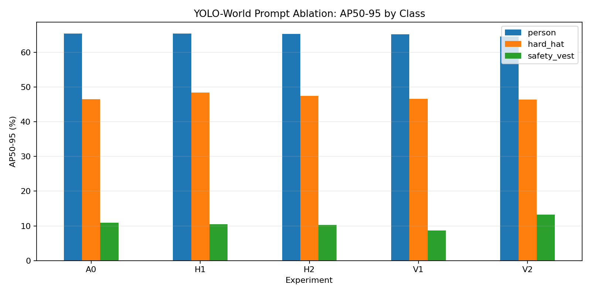
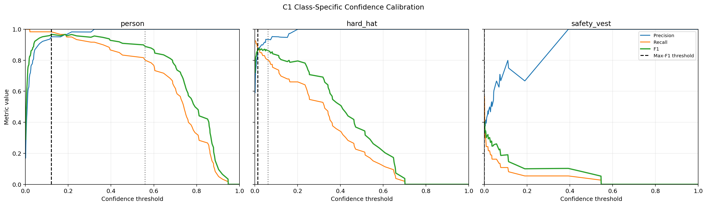

# Grounded PPE Safety Copilot

A computer-vision research project for detecting people, hard hats, and safety vests in workplace images, then producing evidence-grounded PPE compliance results. The current phase establishes a reproducible YOLO-World open-vocabulary baseline before adding supervised detection and multimodal/LLM reasoning.

## Current status

The first four Colab experiments are complete:

1. Smoke-test the YOLO-World inference pipeline.
2. Build and evaluate a 12-image, 150-box development set.
3. Run controlled prompt ablations and select a combined prompt configuration.
4. Calibrate class-specific confidence thresholds and document failure cases.

The selected development configuration is:

```python
["person", "safety helmet", "reflective safety vest"]
```

Key development-set results:

| Configuration | mAP50 | mAP50-95 |
| --- | ---: | ---: |
| A0 baseline | 70.33% | 40.92% |
| C1 combined prompts | 73.00% | 41.87% |

Class-level findings:

- Person detection is strong: 64.92% AP50-95 under C1.
- `safety helmet` improves hard-hat AP50-95 from 46.53% to 48.32% in the combined run.
- Safety-vest AP50-95 improves from 10.87% to 12.38%, but recall remains inadequate.
- No deployable vest threshold was found. Missing vest detections must be reported as **uncertain**, not automatically classified as violations.

These are development-set results from only 12 images. They are not final generalization claims.

### Prompt-ablation evidence



### Threshold-calibration evidence



## Repository structure

```text
.
├── data/
│   └── mini_eval/               # 12 images and YOLO labels used for development evaluation
├── docs/
│   ├── experiment_log.md
│   └── object_detection_project_plan.xlsx
├── notebooks/
│   ├── 01_yoloworld_baseline.ipynb
│   ├── 02_yoloworld_mini_eval.ipynb
│   ├── 03_yoloworld_prompt_ablation.ipynb
│   └── 04_class_threshold_calibration.ipynb
├── results/
│   ├── smoke_test/
│   ├── mini_eval_baseline/
│   ├── prompt_ablation/
│   ├── C1_combined/
│   └── threshold_calibration/
└── requirements-colab.txt
```

## Run in Google Colab

Run the notebooks in numerical order:

- [01 · YOLO-World baseline](https://colab.research.google.com/github/Limeng-svg/Grounded-PPE-Safety-Copilot/blob/main/notebooks/01_yoloworld_baseline.ipynb)
- [02 · Mini evaluation](https://colab.research.google.com/github/Limeng-svg/Grounded-PPE-Safety-Copilot/blob/main/notebooks/02_yoloworld_mini_eval.ipynb)
- [03 · Prompt ablation](https://colab.research.google.com/github/Limeng-svg/Grounded-PPE-Safety-Copilot/blob/main/notebooks/03_yoloworld_prompt_ablation.ipynb)
- [04 · Threshold calibration](https://colab.research.google.com/github/Limeng-svg/Grounded-PPE-Safety-Copilot/blob/main/notebooks/04_class_threshold_calibration.ipynb)

The experiments were reproduced with Ultralytics `8.4.129`, PyTorch `2.11.0+cu128`, and a Tesla T4 GPU. Notebook code copies data from Google Drive into temporary Colab storage for faster validation.

The notebooks first look for the versioned `data/mini_eval/` directory at:

```text
/content/drive/MyDrive/Grounded-PPE-Safety-Copilot/data/mini_eval/
```

This keeps generated outputs persistent in Google Drive. If that directory is absent, notebooks 02-04 automatically clone this repository and use the committed mini-evaluation data as a fallback.

## Research decisions

- Keep C1 as the open-vocabulary baseline.
- Use `0.121` for person and `0.014` for hard-hat only as provisional development thresholds.
- Do not assign a vest deployment threshold from the current data.
- Preserve uncertainty in downstream compliance reasoning.
- Freeze an independent test set before reporting final performance.

## Next phase

1. Expand the vest dataset with clear, occluded, distant, crowded, and negative examples.
2. Create train/development/frozen-test splits with documented provenance.
3. Compare a supervised detector against the YOLO-World baseline.
4. Add person-to-PPE association and rule-based compliance logic.
5. Add a VLM/LLM explanation layer grounded in detected boxes and calibrated uncertainty.
6. Evaluate diffusion-generated hard cases only after a reliable real-image evaluation protocol exists.

## Important limitations

- The mini evaluation set was also used for prompt and threshold selection.
- Safety-vest performance is not sufficient for automatic violation decisions.
- Image provenance and redistribution rights must be documented before treating the dataset as a reusable public benchmark.
- Model weights and large generated output directories are intentionally excluded from Git.
